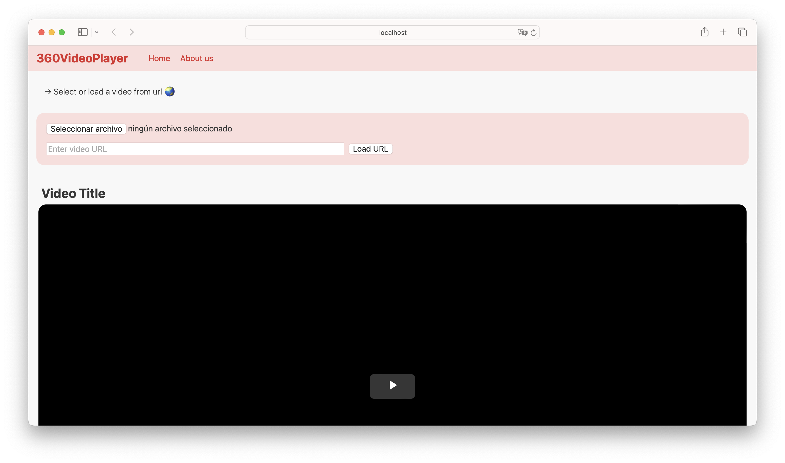

# 360 Video Player

Este proyecto es un reproductor de video 360 grados basado en `video.js` y sus plugins `videojs-vr` y `videojs-panorama`. Permite a los usuarios cargar videos locales o desde una URL y proporciona controles para la reproducción, zoom y movimiento de la cámara.

## Captura de Pantalla



## Demo

Puedes ver una demostración en vivo del reproductor [aquí](https://gioahumada.github.io/360VideoPlayerWEB/).

## Instalación

1. Clona el repositorio:
    ```sh
    git clone <URL_DEL_REPOSITORIO>
    ```
2. Navega al directorio del proyecto:
    ```sh
    cd <NOMBRE_DEL_DIRECTORIO>
    ```
3. Instala las dependencias:
    ```sh
    npm install
    ```

## Uso

1. Abre `index.html` en tu navegador.
2. Selecciona un video local usando el botón de carga de archivos o ingresa una URL de video y haz clic en "Load URL".
3. Usa los controles del reproductor para reproducir, pausar y ajustar el volumen.
4. Usa la rueda del mouse para hacer zoom y las flechas del teclado para mover la cámara.

## Archivos Principales

- **[index.html](index.html)**: Contiene la estructura HTML del reproductor.
- **[main.js](main.js)**: Contiene la lógica JavaScript para inicializar el reproductor y manejar los eventos de usuario.
- **[style.css](style.css)**: Contiene los estilos CSS para el diseño del reproductor.

## Dependencias

- `video.js`: ^8.17.1
- `videojs-panorama`: ^0.1.7
- `videojs-vr`: ^2.0.0

## Contribuciones

Las contribuciones son bienvenidas. Por favor, abre un issue o envía un pull request para discutir cualquier cambio que te gustaría hacer.

## Licencia

Este proyecto está licenciado bajo la Licencia MIT. Consulta el archivo [LICENSE](LICENSE) para más detalles.
